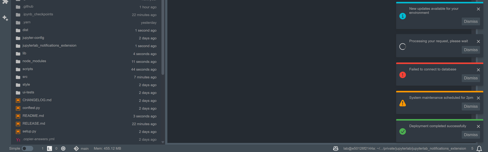
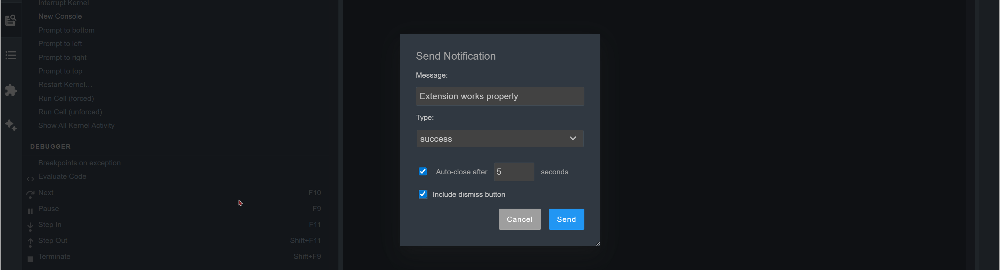

# jupyterlab_notifications_extension

[](https://github.com/stellarshenson/jupyterlab_notifications_extension/actions/workflows/build.yml)
[](https://www.npmjs.com/package/jupyterlab_notifications_extension)
[](https://pypi.org/project/jupyterlab-notifications-extension/)
[](https://pepy.tech/project/jupyterlab-notifications-extension)
[](https://jupyterlab.readthedocs.io/en/stable/)

JupyterLab extension for sending notifications using the native JupyterLab notification system. External systems and extensions send alerts and status updates that appear in JupyterLab's notification center.

This extension serves as the notification backbone for [Stellars JupyterHub Platform for Data Science](https://github.com/stellarshenson/stellars-jupyterhub-ds), allowing administrators to broadcast notification messages to all running JupyterLab servers.

Five notification types with distinct visual styling provide clear status communication:



Access via command palette for quick manual notification sending:


Interactive dialog with message input, type selection, auto-close timing, and action button options:



**Key Features:**

- REST API for external systems to POST notifications with authentication
- Command palette integration with interactive dialog
- Programmatic command API for extensions and automation
- Five notification types (info, success, warning, error, in-progress)
- Configurable auto-close with millisecond precision or manual dismiss
- Optional action buttons (currently dismiss only)
- Broadcast delivery via 30-second polling
- In-memory queue cleared after delivery

## Installation

```bash
pip install jupyterlab_notifications_extension
```

**Requirements**: JupyterLab >= 4.0.0

## API Reference

### POST /jupyterlab-notifications-extension/ingest

Send notifications to JupyterLab. Requires authentication via `Authorization: token <TOKEN>` header or `?token=<TOKEN>` query parameter. Requests from localhost (127.0.0.1, ::1) skip authentication.

**Endpoint**: `POST /jupyterlab-notifications-extension/ingest`

**Request Body** (application/json):

```json
{
  "message": "Your notification message",
  "type": "info",
  "autoClose": 5000,
  "actions": [
    {
      "label": "Click here",
      "caption": "Additional info",
      "displayType": "accent"
    }
  ]
}
```

**Request Parameters**:

| Field       | Type           | Required | Default  | Description                                                                                                             |
| ----------- | -------------- | -------- | -------- | ----------------------------------------------------------------------------------------------------------------------- |
| `message`   | string         | Yes      | -        | Notification text (max 140 characters)                                                                                  |
| `type`      | string         | No       | `"info"` | Visual style: `default`, `info`, `success`, `warning`, `error`, `in-progress`                                           |
| `autoClose` | number/boolean | No       | `5000`   | Milliseconds before auto-dismiss. `false` = manual dismiss only. `0` = silent mode (notification center only, no toast) |
| `actions`   | array          | No       | `[]`     | Action buttons (see below)                                                                                              |

**Action Button Schema**:

| Field         | Type   | Required | Default     | Description                                       |
| ------------- | ------ | -------- | ----------- | ------------------------------------------------- |
| `label`       | string | Yes      | -           | Button text                                       |
| `caption`     | string | No       | `""`        | Tooltip text                                      |
| `displayType` | string | No       | `"default"` | Visual style: `default`, `accent`, `warn`, `link` |

Note: Action buttons are purely visual. Clicking any button dismisses the notification using JupyterLab's native behavior. Buttons do not trigger custom callbacks or actions.

**Response** (200 OK):

```json
{
  "success": true,
  "notification_id": "notif_1762549476180_0"
}
```

**Error Responses**:

- `400 Bad Request` - Missing `message` field or invalid JSON
- `401 Unauthorized` - Missing or invalid authentication token
- `500 Internal Server Error` - Server-side processing error

## Usage Examples

### From JupyterLab Extensions

Send notifications programmatically from other extensions:

```javascript
// Basic notification
await app.commands.execute('jupyterlab-notifications:send', {
  message: 'Operation complete'
});

// Custom type and auto-close
await app.commands.execute('jupyterlab-notifications:send', {
  message: 'Build finished successfully',
  type: 'success',
  autoClose: 3000
});

// With action button
await app.commands.execute('jupyterlab-notifications:send', {
  message: 'Error processing data',
  type: 'error',
  autoClose: false,
  actions: [{ label: 'View Details', displayType: 'accent' }]
});
```

### Python Script

The included script auto-detects tokens from `JUPYTERHUB_API_TOKEN`, `JPY_API_TOKEN`, or `JUPYTER_TOKEN` environment variables:

```bash
# Basic notification
./scripts/send_notification.py --message "Deployment complete" --type success

# Persistent warning (no auto-close)
./scripts/send_notification.py --message "System maintenance in 1 hour" --type warning --no-auto-close

# Silent mode (notification center only)
./scripts/send_notification.py --message "Background task finished" --auto-close 0
```

### cURL

```bash
# Basic info notification
curl -X POST http://localhost:8888/jupyterlab-notifications-extension/ingest \
  -H "Content-Type: application/json" \
  -H "Authorization: token YOUR_TOKEN" \
  -d '{"message": "Build completed", "type": "info"}'

# Error notification with action button
curl -X POST http://localhost:8888/jupyterlab-notifications-extension/ingest \
  -H "Content-Type: application/json" \
  -H "Authorization: token YOUR_TOKEN" \
  -d '{
    "message": "Build failed on main branch",
    "type": "error",
    "autoClose": false,
    "actions": [{
      "label": "View Logs",
      "caption": "Open build logs",
      "displayType": "accent"
    }]
  }'
```

## Architecture

Broadcast-only model - all notifications delivered to the JupyterLab server.

**Flow**: External system POSTs to `/jupyterlab-notifications-extension/ingest` -> Server queues in memory -> Frontend polls `/jupyterlab-notifications-extension/notifications` every 30 seconds -> Displays via JupyterLab notification manager -> Clears queue after fetch.

## Troubleshooting

**Frontend installed but not working**:

```bash
jupyter server extension list  # Verify server extension enabled
```

**Server extension enabled but frontend missing**:

```bash
jupyter labextension list  # Verify frontend extension installed
```

**Notifications not appearing**: Check browser console for polling errors or verify JupyterLab was restarted after installation.

## Uninstall

```bash
pip uninstall jupyterlab_notifications_extension
```

## Development

### Setup

Requires NodeJS to build the extension. Uses `jlpm` (JupyterLab's pinned yarn) for package management.

```bash
# Install in development mode
python -m venv .venv
source .venv/bin/activate
pip install --editable ".[dev,test]"

# Link extension with JupyterLab
jupyter labextension develop . --overwrite
jupyter server extension enable jupyterlab_notifications_extension

# Build TypeScript
jlpm build
```

### Development workflow

Run `jlpm watch` in one terminal to auto-rebuild on changes, and `jupyter lab` in another. Refresh browser after rebuilds to load changes.

```bash
jlpm watch           # Auto-rebuild on file changes
jupyter lab          # Run JupyterLab
```

### Cleanup

```bash
jupyter server extension disable jupyterlab_notifications_extension
pip uninstall jupyterlab_notifications_extension
# Remove symlink: find via `jupyter labextension list`
```

### Testing

**Python tests** (Pytest):

```bash
pip install -e ".[test]"
pytest -vv -r ap --cov jupyterlab_notifications_extension
```

**Frontend tests** (Jest):

```bash
jlpm test
```

**Integration tests** (Playwright/Galata): See [ui-tests/README.md](ui-tests/README.md)

### Packaging

See [RELEASE.md](RELEASE.md) for release procedures.
