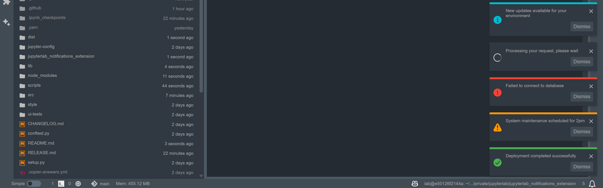
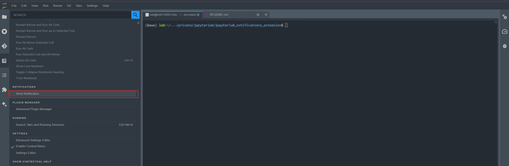
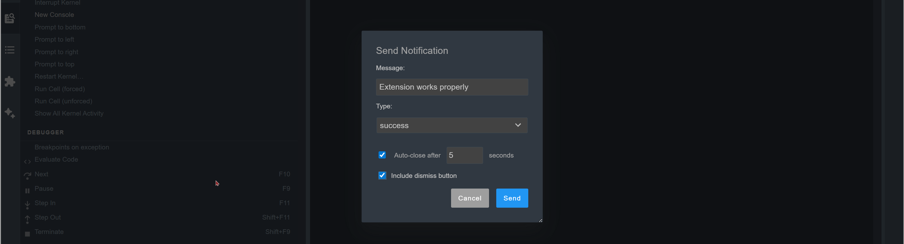

# jupyterlab_notifications_extension

[](https://github.com/stellarshenson/jupyterlab_notifications_extension/actions/workflows/build.yml)
[](https://www.npmjs.com/package/jupyterlab_notifications_extension)
[](https://pypi.org/project/jupyterlab-notifications-extension/)
[](https://pepy.tech/project/jupyterlab-notifications-extension)
[](https://jupyterlab.readthedocs.io/en/stable/)

> [!TIP]
> This extension is part of the [stellars_jupyterlab_extensions](https://github.com/stellarshenson/stellars_jupyterlab_extensions) metapackage. Install all Stellars extensions at once: `pip install stellars_jupyterlab_extensions`

JupyterLab extension for sending notifications using the native JupyterLab notification system. External systems and extensions send alerts and status updates that appear in JupyterLab's notification center.

This extension serves as the notification backbone for [Stellars JupyterHub Platform for Data Science](https://github.com/stellarshenson/stellars-jupyterhub-ds), allowing administrators to broadcast notification messages to all running JupyterLab servers.

Five notification types with distinct visual styling provide clear status communication:



Access via command palette for quick manual notification sending:



Interactive dialog with message input, type selection, auto-close timing, and action button options:



**Key Features:**

- REST API for external systems to POST notifications with authentication
- Command palette integration with interactive dialog
- Programmatic command API for extensions and automation
- Six notification types (default, info, success, warning, error, in-progress)
- Configurable auto-close with millisecond precision or manual dismiss
- Action buttons with optional JupyterLab command execution
- Dynamic time-ago indicator showing when each notification was generated
- Broadcast delivery via 30-second polling
- Immediate WebSocket push for instant display (`--now` / `"immediate": true`)
- In-memory queue cleared after delivery

## Installation

```bash
pip install jupyterlab_notifications_extension
```

**Requirements**: JupyterLab >= 4.0.0

## API Reference

### POST /jupyterlab-notifications-extension/ingest

Send notifications to JupyterLab. Requires authentication via `Authorization: token <TOKEN>` header or `?token=<TOKEN>` query parameter.

Token-free localhost ingest is opt-in and off by default: set the environment variable `JUPYTERLAB_NOTIFICATIONS_ALLOW_UNAUTHENTICATED_LOCALHOST=1` on the server to let genuine loopback (127.0.0.1, ::1) requests skip authentication. It is disabled by default because a same-host reverse proxy makes every external client's address appear as `127.0.0.1`, which would otherwise open ingest to unauthenticated callers.

**Endpoint**: `POST /jupyterlab-notifications-extension/ingest`

**Request Body** (application/json):

```json
{
  "message": "Your notification message",
  "type": "info",
  "autoClose": 5000,
  "immediate": true,
  "actions": [
    {
      "label": "Click here",
      "caption": "Additional info",
      "displayType": "accent"
    }
  ]
}
```

**Request Parameters**:

| Field       | Type           | Required | Default  | Description                                                                                                                            |
| ----------- | -------------- | -------- | -------- | -------------------------------------------------------------------------------------------------------------------------------------- |
| `message`   | string         | Yes      | -        | Notification text                                                                                                                      |
| `type`      | string         | No       | `"info"` | Visual style: `default`, `info`, `success`, `warning`, `error`, `in-progress`                                                          |
| `autoClose` | number/boolean | No       | `5000`   | Milliseconds before auto-dismiss. `false` = manual dismiss only. `0` = silent mode (notification center only, no toast)                |
| `immediate` | boolean        | No       | `false`  | Push instantly to connected clients via WebSocket instead of waiting for the next poll (see [Immediate Delivery](#immediate-delivery)) |
| `actions`   | array          | No       | `[]`     | Action buttons (see below)                                                                                                             |

**Action Button Schema**:

| Field         | Type   | Required | Default     | Description                                                      |
| ------------- | ------ | -------- | ----------- | ---------------------------------------------------------------- |
| `label`       | string | Yes      | -           | Button text                                                      |
| `caption`     | string | No       | `""`        | Tooltip text                                                     |
| `displayType` | string | No       | `"default"` | Visual style: `default`, `accent`, `warn`, `link`                |
| `commandId`   | string | No       | -           | JupyterLab command ID to execute (e.g., `filebrowser:open-path`) |
| `args`        | object | No       | `{}`        | Arguments passed to the command                                  |

Note: Clicking any button dismisses the notification. If `commandId` is provided, the specified JupyterLab command executes before dismissal.

**Response** (200 OK):

```json
{
  "success": true,
  "notification_id": "notif_1762549476180_1"
}
```

**Error Responses**:

- `400 Bad Request` - Missing `message` field or invalid JSON
- `401 Unauthorized` - Missing or invalid authentication token
- `500 Internal Server Error` - Server-side processing error

## Usage Examples

### From JupyterLab Extensions

Send notifications programmatically from other extensions:

```javascript
// Basic notification
await app.commands.execute('jupyterlab-notifications:send', {
  message: 'Operation complete'
});

// Custom type and auto-close
await app.commands.execute('jupyterlab-notifications:send', {
  message: 'Build finished successfully',
  type: 'success',
  autoClose: 3000
});

// With dismiss button
await app.commands.execute('jupyterlab-notifications:send', {
  message: 'Error processing data',
  type: 'error',
  autoClose: false,
  actions: [{ label: 'Dismiss', displayType: 'default' }]
});

// Action button that executes a JupyterLab command
await app.commands.execute('jupyterlab-notifications:send', {
  message: 'Help Available!',
  type: 'info',
  autoClose: false,
  actions: [
    {
      label: 'Open Help',
      commandId: 'iframe:open',
      args: { path: 'local:///welcome.html' },
      displayType: 'accent'
    }
  ]
});
```

### CLI Tool

The `jupyterlab-notify` command is installed with the extension:

```bash
# Basic notification (auto-detects URL from running servers)
jupyterlab-notify -m "Deployment complete" -t success

# With explicit URL (e.g., JupyterHub)
jupyterlab-notify --url "http://127.0.0.1:8888/jupyterhub/user/alice" -m "Hello"

# Persistent warning (no auto-close)
jupyterlab-notify -m "System maintenance in 1 hour" -t warning --no-auto-close

# With dismiss button
jupyterlab-notify -m "Task complete" --action "Dismiss"

# Action button that executes a JupyterLab command
jupyterlab-notify -m "Help Available!" --action "Open Help" \
  --cmd "iframe:open" --command-args '{"path": "local:///welcome.html"}'

# Silent mode (notification center only, no toast)
jupyterlab-notify -m "Background task finished" --auto-close 0

# Immediate display (push now, don't wait for the next poll)
jupyterlab-notify -m "Deploy finished" --now
```

**URL auto-detection**: Queries `jupyter server list --json` to find running servers and constructs localhost URL. Falls back to `JUPYTERHUB_SERVICE_PREFIX` environment variable or `localhost:8888`.

**`--now`**: Pushes the notification instantly to any open JupyterLab tab via WebSocket instead of waiting up to 30 seconds for the next poll (see [Immediate Delivery](#immediate-delivery)).

### cURL

```bash
# Localhost - no authentication required
curl -X POST http://localhost:8888/jupyterlab-notifications-extension/ingest \
  -H "Content-Type: application/json" \
  -d '{"message": "Build completed", "type": "success"}'

# Localhost - warning that stays until dismissed
curl -X POST http://localhost:8888/jupyterlab-notifications-extension/ingest \
  -H "Content-Type: application/json" \
  -d '{"message": "System maintenance in 1 hour", "type": "warning", "autoClose": false}'

# Remote - requires authentication token
curl -X POST http://jupyterhub.example.com/user/alice/jupyterlab-notifications-extension/ingest \
  -H "Content-Type: application/json" \
  -H "Authorization: token YOUR_JUPYTER_TOKEN" \
  -d '{"message": "Deployment complete", "type": "info"}'

# Immediate display - push now instead of waiting for the next poll
curl -X POST http://localhost:8888/jupyterlab-notifications-extension/ingest \
  -H "Content-Type: application/json" \
  -d '{"message": "Deploy finished", "type": "success", "immediate": true}'
```

## Immediate Delivery

By default a notification waits up to 30 seconds for the frontend's next poll before it appears. Setting `immediate` (REST/cURL) or passing `--now` (CLI) pushes it instantly to every open JupyterLab tab over a WebSocket, so it displays the moment it is sent.

- **Transport**: the frontend keeps a WebSocket open to `/jupyterlab-notifications-extension/stream`; the server pushes flagged notifications to all connected clients
- **Push reaches every connected tab**: unlike the poll, the immediate push is delivered to all currently-open tabs at once
- **Poll is best-effort**: the poll queue is a single-consumer destructive drain - the first tab to poll empties it for all tabs - so a tab whose socket is down at push time is not guaranteed to receive that notification via the poll; the push is an accelerator over a best-effort baseline, not a durable per-client queue
- **Keepalive**: the socket uses ping/pong to survive proxy idle timeouts (works behind JupyterHub)
- **De-duplication**: the frontend tracks notification IDs (bounded), so a notification arriving via both the push and the poll is displayed only once
- **Reconnect**: the socket reconnects with capped exponential backoff and gives up after a bounded number of attempts, degrading to poll-only

## Time-Ago Indicator

Each notification displays a relative timestamp (e.g., `just now`, `5m ago`, `2h ago`, `3d ago`) that updates every 10 seconds while the notification remains visible. Anything under a minute shows `just now`. The indicator appears below the message when no action buttons are present, or inline with the button bar when buttons exist. The notification center panel also shows time-ago for all listed notifications.

## Architecture

Broadcast-only model - all notifications delivered to the JupyterLab server.

**Flow**: External system POSTs to `/jupyterlab-notifications-extension/ingest` -> Server queues in memory -> Frontend polls `/jupyterlab-notifications-extension/notifications` every 30 seconds -> Displays via JupyterLab notification manager -> Clears queue after fetch. Notifications flagged `immediate` are additionally pushed over a WebSocket (`/jupyterlab-notifications-extension/stream`) for instant display, deduplicated against the poll by notification ID.

## Troubleshooting

**Frontend installed but not working**:

```bash
jupyter server extension list  # Verify server extension enabled
```

**Server extension enabled but frontend missing**:

```bash
jupyter labextension list  # Verify frontend extension installed
```

**Notifications not appearing**: Check browser console for polling errors or verify JupyterLab was restarted after installation.

## Uninstall

```bash
pip uninstall jupyterlab_notifications_extension
```

## Development

### Setup

Requires NodeJS to build the extension. Uses `jlpm` (JupyterLab's pinned yarn) for package management.

```bash
# Install in development mode
python -m venv .venv
source .venv/bin/activate
pip install --editable ".[dev,test]"

# Link extension with JupyterLab
jupyter labextension develop . --overwrite
jupyter server extension enable jupyterlab_notifications_extension

# Build TypeScript
jlpm build
```

### Development workflow

Run `jlpm watch` in one terminal to auto-rebuild on changes, and `jupyter lab` in another. Refresh browser after rebuilds to load changes.

```bash
jlpm watch           # Auto-rebuild on file changes
jupyter lab          # Run JupyterLab
```

### Cleanup

```bash
jupyter server extension disable jupyterlab_notifications_extension
pip uninstall jupyterlab_notifications_extension
# Remove symlink: find via `jupyter labextension list`
```

### Testing

**Python tests** (Pytest):

```bash
pip install -e ".[test]"
pytest -vv -r ap --cov jupyterlab_notifications_extension
```

**Frontend tests** (Jest):

```bash
jlpm test
```

**Integration tests** (Playwright/Galata): See [ui-tests/README.md](ui-tests/README.md)

### Packaging

See [RELEASE.md](RELEASE.md) for release procedures.
